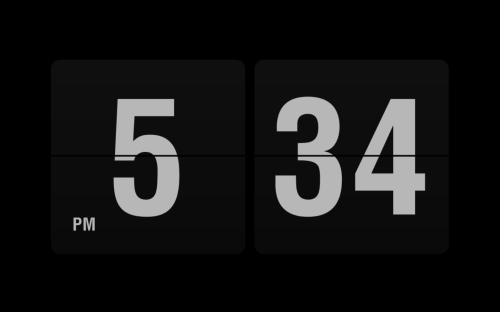
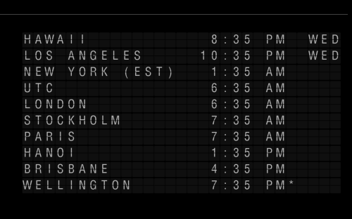

# FlipIt

Flip Clock Screensaver. Inspired by [Fliqlo](http://fliqlo.com/). Fliqlo on Windows stopped working with a recent (Dec 2015?) Flash update which prompted this project. This project does NOT use Flash.

## Requirements

* Microsoft Windows
* .NET Framework 4.8

## Installation

To install without building with Visual Studio, copy the .scr file on the [Releases](https://github.com/phaselden/FlipIt/releases) page to:
    * C:\Windows\SysWOW64 on 64-bit Windows.
    * C:\Windows\System32 on 32-bit Windows

## Building with Visual Studio

Run in Release mode and Run as Administrator to have the build event copy the screensaver to the Windows SysWOW64 or System32 folder. Set the Command line arguments to `/s` to have the screensaver display full screen on F5/Start.

## Desktop clock mode (桌面时钟)

The same code can also run as a lightweight desktop clock in a **borderless** window (no title bar).
It does **not** appear on the taskbar — instead it lives in the **system tray** (notification area,
bottom-right) and can be hidden there to get it out of the way.

The build produces a ready-to-run **`桌面时钟.exe`** next to `FlipIt.exe`; just double-click it.
(Equivalently, run `FlipIt.exe /d`.)

It reuses the screensaver's renderer, so it honours all the same settings (12/24h, seconds, scale,
flip animation, date / lunar calendar). To keep it light on resources it only repaints when the
displayed time changes, and only runs at animation frame-rate during the fraction of a second a card
is actually flipping — and while hidden in the tray it draws nothing at all, so an idle clock costs
almost no CPU.

* **Drag** anywhere on the clock with the left mouse button to move it; drag the window **edges** to
  resize. The size, position and "always on top" state are remembered between runs.
* **Tray icon** — left-click it to show / hide the clock; right-click it for the menu.
* **Right-click** the clock (or the tray icon) for a menu: 显示 / 隐藏窗口, 窗口置顶 (always on top),
  设置… (open the settings dialog), 退出 (exit).
* **Esc** closes it.
* **Live settings** — it watches the settings file, so when you save in the configuration dialog (even
  from a separate `FlipIt.exe`) the running clock updates immediately.

The existing screensaver behaviour is unchanged — the build still produces both `FlipIt.exe` and
`FlipIt.scr`, and the `/s` (full-screen), `/p` (preview) and `/c` (configure) modes work exactly as
before.

## Acknowledgements

Source code originally based on the article and code [Creating a Screen Saver with C#](http://www.harding.edu/fmccown/screensaver/screensaver.html) by Frank McCown.

This work is licensed under a [Creative Commons License](http://creativecommons.org/licenses/by-sa/2.0/).
